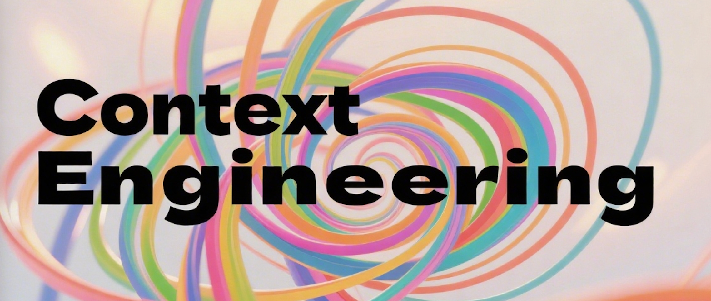

# Awesome Context Engineering

<div align="center">
  
</div>

[](https://awesome.re)
[](https://opensource.org/licenses/MIT)
[](http://makeapullrequest.com)
[](https://github.com/your-repo/awesome-context-engineering)

> 📄 **Our comprehensive survey paper on Context Engineering is coming soon!** Stay tuned for the latest academic insights and theoretical foundations.

A comprehensive survey and collection of resources on **Context Engineering** - the evolution from static prompting to dynamic, context-aware AI systems.

## ⚠️ Disclaimer

This project is **ongoing** and continuously evolving. While we strive for accuracy and completeness, there may be errors, omissions, or outdated information. We welcome corrections, suggestions, and contributions from the community. Please stay tuned for regular updates and improvements.

---

## 📰 News

- **[2025.7]** Repository initialized with comprehensive outline
- **[2025.7]** Survey structure established following modern context engineering paradigms

---

## 🎯 Introduction

In the era of Large Language Models (LLMs), the limitations of static prompting have become increasingly apparent. **Context Engineering** represents the natural evolution to address LLM uncertainty and achieve production-grade AI deployment. Unlike traditional prompt engineering, context engineering encompasses the complete information payload provided to LLMs at inference time, including all structured informational components necessary for plausible task completion.

This repository serves as a comprehensive survey of context engineering techniques, methodologies, and applications.

---

## 📚 Table of Contents

- [Related Survey](#related-survey)
- [Definition of Context Engineering](#definition-of-context-engineering)
- [Why Context Engineering?](#why-context-engineering)
- [Components, Techniques and Architectures](#contextual-components-techniques-and-architectures)
- [Implementation and Challenges](#implementation-challenges-and-mitigation-strategies)
- [Evaluation Paradigms for Context-Driven Systems](#evaluation-paradigms-for-context-driven-systems)
- [Applications and Systems](#applications-and-systems)
- [Limitations and Future Directions](#limitations-and-future-directions)

---

## 🔗 Related Survey

<b>General AI Survey Papers</b>

<ul>
<li><i><b>A Survey of Large Language Models</b></i>, Zhao et al.,<a href="https://arxiv.org/abs/2303.18223" target="_blank"></a>
    <a href="https://github.com/RUCAIBox/LLMSurvey" target="_blank">
  		
    </a>
</li>
<li><i><b>The Prompt Report: A Systematic Survey of Prompt Engineering Techniques</b></i>, Schulhoff et al., <a href="https://arxiv.org/abs/2406.06608" target="_blank"></a>
    <a href="https://github.com/trigaten/The_Prompt_Report" target="_blank">
  		
    </a></li>
<li><i><b>A Systematic Survey of Prompt Engineering in Large Language Models: Techniques and Applications</b></i>, Sahoo et al., <a href="https://arxiv.org/abs/2402.07927" target="_blank"></a>
    </li>
<li><i><b>A Systematic Survey of Prompt Engineering on Vision-Language Foundation Models</b></i>, Gao et al., <a href="https://arxiv.org/abs/2307.12980" target="_blank"></a>
    <a href="https://github.com/JindongGu/Awesome-Prompting-on-Vision-Language-Model" target="_blank">
  		
    </a></li>
</ul>

<b>Context and Reasoning</b>

<ul>
<li><i><b>A Survey on In-context Learning</b></i>, Dong et al., <a href="https://doi.org/10.18653/v1/2024.emnlp-main.64" target="_blank"></a>
<a href="https://github.com/dqxiu/ICL_PaperList" target="_blank">
  		
    </a></li>
<li><i><b>The Mystery of In-Context Learning: A Comprehensive Survey on Interpretation and Analysis</b></i>, Zhou et al., <a href="https://arxiv.org/abs/2311.00237" target="_blank"></a>
<a href="https://github.com/zyxnlp/ICL-Interpretation-Analysis-Resources" target="_blank">
  		
    </a></li>
<li><i><b>A Comprehensive Survey of Retrieval-Augmented Generation (RAG): Evolution, Current Landscape and Future Directions</b></i>, Gupta et al., <a href="https://arxiv.org/abs/2410.12837" target="_blank"></a>
    </li>
<li><i><b>Retrieval-Augmented Generation for Large Language Models: A Survey</b></i>, Gao et al., <a href="https://arxiv.org/abs/2312.10997" target="_blank"></a>
<a href="https://github.com/Tongji-KGLLM/RAG-Survey" target="_blank">
  		
    </a></li>
<li><i><b>A Survey on Knowledge-Oriented Retrieval-Augmented Generation</b></i>, Cheng et al., <a href="https://arxiv.org/abs/2503.10677" target="_blank"></a>
<a href="https://github.com/USTCAGI/Awesome-Papers-Retrieval-Augmented-Generation" target="_blank">
  		
    </a></li>
</ul>

<b>Memory Systems and Context Persistence</b>

<b>Survey</b>
<ul>
<li><i><b>A Survey on the Memory Mechanism of Large Language Model based Agents</b></i>, Zhang et al., <a href="https://arxiv.org/abs/2404.13501" target="_blank"></a>
    <a href="https://github.com/nuster1128/LLM_Agent_Memory_Survey" target="_blank">
  		
    </a></li>
<li><i><b>Survey on Memory-Augmented Neural Networks: Cognitive Insights to AI Applications</b></i>, Khosla et al., <a href="https://arxiv.org/abs/2312.06141" target="_blank"></a>
    </li>
<li><i><b>From Human Memory to AI Memory: A Survey on Memory Mechanisms in the Era of LLMs</b></i>, Wu et al., <a href="https://arxiv.org/abs/2504.15965" target="_blank"></a>
    </li>
<li><i><b>Survey on Evaluation of LLM-based Agents</b></i>, Anonymous et al., <a href="https://arxiv.org/abs/2503.16416" target="_blank"></a>
    </li>
<li><i><b>A Survey of Personalized Large Language Models: Progress and Future Directions</b></i>, Anonymous et al., <a href="https://arxiv.org/abs/2502.11528" target="_blank"></a>
    </li>
<li><i><b>Agentic Retrieval-Augmented Generation: A Survey</b></i>, Anonymous et al., <a href="https://arxiv.org/abs/2501.09136" target="_blank"></a>
    </li>
<li><i><b>Retrieval-Augmented Generation with Graphs (GraphRAG)</b></i>, Anonymous et al., <a href="https://arxiv.org/abs/2501.00309" target="_blank"></a>
    <a href="https://github.com/Graph-RAG/GraphRAG/" target="_blank">
  		
    </a></li>
</ul>

<b>Benchmarks</b>
<ul>
<li><i><b>Evaluating Very Long-Term Conversational Memory of LLM Agents (LOCOMO)</b></i>, Anonymous et al., <a href="https://arxiv.org/abs/2402.17753" target="_blank"></a>
    <a href="https://snap-research.github.io/locomo/" target="_blank">
  		
    </a></li>
<li><i><b>Episodic Memories Generation and Evaluation Benchmark for Large Language Models</b></i>, Anonymous et al., <a href="https://arxiv.org/abs/2501.13121" target="_blank"></a>
    </li>
<li><i><b>On the Structural Memory of LLM Agents</b></i>, Anonymous et al., <a href="https://arxiv.org/abs/2412.15266" target="_blank"></a>
    </li>
<li><i><b>HotpotQA: A Dataset for Diverse, Explainable Multi-hop Question Answering</b></i>, Yang et al., <a href="https://arxiv.org/abs/1809.09600" target="_blank"></a>
    <a href="https://hotpotqa.github.io/" target="_blank">
  		
    </a></li>
</ul>
<b>Neural Memory Architectures</b>

<ul>
<li><i><b>Neural Turing Machines</b></i>, Graves et al., <a href="https://arxiv.org/abs/1410.5401" target="_blank"></a>
    </li>
<li><i><b>Differentiable Neural Computers</b></i>, Graves et al., <a href="https://arxiv.org/abs/1610.06258" target="_blank"></a>
    <a href="https://github.com/google-deepmind/dnc" target="_blank">
  		
    </a></li>
<li><i><b>A Brain-inspired Memory Transformation based Differentiable Neural Computer</b></i>, Anonymous et al., <a href="https://arxiv.org/abs/2301.02809" target="_blank"></a>
    </li>
<li><i><b>Differentiable Neural Computers with Memory Demon</b></i>, Anonymous et al., <a href="https://arxiv.org/abs/2211.02987" target="_blank"></a>
    </li>
</ul>
<b>Memory-Augmented Transformers</b>

<ul>
<li><i><b>Memorizing Transformers</b></i>, Wu et al., <a href="https://arxiv.org/abs/2203.08913" target="_blank"></a>
    </li>
<li><i><b>Recurrent Memory Transformer</b></i>, Bulatov et al., <a href="https://arxiv.org/abs/2207.06881" target="_blank"></a>
    <a href="https://github.com/booydar/recurrent-memory-transformer" target="_blank">
  		
    </a></li>
<li><i><b>Leave No Context Behind: Efficient Infinite Context Transformers with Infini-attention</b></i>, Munkhdalai et al., <a href="https://arxiv.org/abs/2404.07143" target="_blank"></a>
    </li>
<li><i><b>Memformer: A Memory-Augmented Transformer for Sequence Modeling</b></i>, Wu et al., <a href="https://arxiv.org/abs/2010.06891" target="_blank"></a>
    </li>
<li><i><b>Token Turing Machines</b></i>, Ryoo et al., <a href="https://arxiv.org/abs/2211.09119" target="_blank"></a>
    </li>
<li><i><b>TransformerFAM: Feedback Attention is Working Memory</b></i>, Irie et al., <a href="https://arxiv.org/abs/2404.09173" target="_blank"></a>
    </li>
</ul>

<b>Production Memory Systems</b>
<ul>
<li><i><b>MemGPT: Towards LLMs as Operating Systems</b></i>, Packer et al., <a href="https://arxiv.org/abs/2310.08560" target="_blank"></a>
    <a href="https://research.memgpt.ai" target="_blank">
  		
    </a></li>
<li><i><b>MemoryBank: Enhancing Large Language Models with Long-Term Memory</b></i>, Zhong et al., <a href="https://arxiv.org/abs/2305.10250" target="_blank"></a>
    <a href="https://github.com/zhongwanjun/memorybank-siliconfriend" target="_blank">
  		
    </a></li>
<li><i><b>MEM0: Building Production-Ready AI Agents with Scalable Long-Term Memory</b></i>, Taranjeet et al., <a href="https://arxiv.org/abs/2504.19413" target="_blank"></a>
    <a href="https://mem0.ai/research" target="_blank">
  		
    </a></li>
<li><i><b>MEM1: Learning to Synergize Memory and Reasoning for Efficient Long-Horizon Agents</b></i>, Anonymous et al., <a href="https://arxiv.org/abs/2506.15841" target="_blank"></a>
    <a href="https://github.com/mannaandpoem/openmanus" target="_blank">
  		
    </a></li>
<li><i><b>A-MEM: Agentic Memory for LLM Agents</b></i>, Anonymous et al., <a href="https://arxiv.org/abs/2502.12110" target="_blank"></a>
    <a href="https://github.com/agiresearch/A-mem" target="_blank">
  		
    </a></li>
</ul>
<b>Graph-based Memory Systems</b>

<ul>
<li><i><b>arigraph: learning knowledge graph world models with episodic memory for llm agents</b></i>, Anonymous et al., <a href="https://arxiv.org/abs/2407.04363" target="_blank"></a>
    </li>
<li><i><b>Zep: A Temporal Knowledge Graph Architecture for Agent Memory</b></i>, Anonymous et al., <a href="https://arxiv.org/abs/2501.13956" target="_blank"></a>
    <a href="https://github.com/getzep/graphiti" target="_blank">
  		
    </a></li>
<li><i><b>KG-Agent: An Efficient Autonomous Agent Framework for Complex Reasoning over Knowledge Graph</b></i>, Anonymous et al., <a href="https://arxiv.org/abs/2402.11163" target="_blank"></a>
    </li>
<li><i><b>GraphReader: Building Graph-based Agent to Enhance Long-Context Abilities of Large Language Models</b></i>, Anonymous et al., <a href="https://arxiv.org/abs/2406.14550" target="_blank"></a>
    </li>
<li><i><b>From Local to Global: A GraphRAG Approach to Query-Focused Summarization</b></i>, Edge et al., <a href="https://arxiv.org/abs/2404.16130" target="_blank"></a>
    <a href="https://github.com/microsoft/graphrag" target="_blank">
  		
    </a></li>
<li><i><b>Knowledge Graph-Guided Retrieval Augmented Generation</b></i>, Zhu et al., <a href="https://arxiv.org/abs/2502.06864" target="_blank"></a>
    </li>
</ul>
<b>Episodic and Working Memory</b>

<ul>
<li><i><b>Larimar: Large Language Models with Episodic Memory Control</b></i>, Goyal et al., <a href="https://arxiv.org/abs/2403.11901" target="_blank"></a>
    </li>
<li><i><b>EM-LLM: Human-like Episodic Memory for Infinite Context LLMs</b></i>, Anonymous et al., <a href="https://arxiv.org/abs/2407.09450" target="_blank"></a>
    <a href="https://github.com/em-llm/EM-LLM-model" target="_blank">
  		
    </a></li>
<li><i><b>Large Language Models with Controllable Working Memory</b></i>, Goyal et al., <a href="https://arxiv.org/abs/2211.05110" target="_blank"></a>
    </li>
<li><i><b>Empowering Working Memory for Large Language Model Agents</b></i>, Anonymous et al., <a href="https://arxiv.org/abs/2312.17259" target="_blank"></a>
    </li>
</ul>
<b>Conversational Memory</b>

<ul>
<li><i><b>MemoChat: Tuning LLMs to Use Memos for Consistent Long-Range Open-Domain Conversation</b></i>, Anonymous et al., <a href="https://arxiv.org/abs/2308.08239" target="_blank"></a>
    </li>
<li><i><b>Think-in-Memory: Recalling and Post-thinking Enable LLMs with Long-Term Memory</b></i>, Anonymous et al., <a href="https://arxiv.org/abs/2311.08719" target="_blank"></a>
    </li>
<li><i><b>Generative Agents: Interactive Simulacra of Human Behavior</b></i>, Park et al., <a href="https://arxiv.org/abs/2304.03442" target="_blank"></a>
    </li>
<li><i><b>Self-Controlled Memory Framework for Large Language Models</b></i>, Anonymous et al., <a href="https://arxiv.org/abs/2304.13343" target="_blank"></a>
    </li>
</ul>
<b>Foundational Survey Papers from Major Venues</b>

<ul>
<li><i><b>AUTOPROMPT: Eliciting Knowledge from Language Models with Automatically Generated Prompts</b></i>, Shin et al., <a href="#" target="_blank"></a>
    <a href="https://github.com/ucinlp/autoprompt" target="_blank">
  		
    </a></li>
<li><i><b>The Power of Scale for Parameter-Efficient Prompt Tuning</b></i>, Lester et al., <a href="#" target="_blank"></a>
    <a href="https://github.com/google-research/prompt-tuning" target="_blank">
  		
    </a></li>
<li><i><b>Prefix-Tuning: Optimizing Continuous Prompts for Generation</b></i>, Li et al., <a href="#" target="_blank"></a>
    <a href="https://github.com/XiangLi1999/PrefixTuning" target="_blank">
  		
    </a></li>
<li><i><b>An Explanation of In-context Learning as Implicit Bayesian Inference</b></i>, Xie et al., <a href="#" target="_blank"></a>
    <a href="https://github.com/p-lambda/incontext-learning" target="_blank">
  		
    </a></li>
<li><i><b>Rethinking the Role of Demonstrations: What Makes In-Context Learning Work?</b></i>, Min et al., <a href="#" target="_blank"></a>
    <a href="https://github.com/Alrope123/rethinking-demonstrations" target="_blank">
  		
    </a></li>
</ul>


<b>Additional RAG and Retrieval Surveys</b>
<ul>
<li><i><b>Retrieval-Augmented Generation for AI-Generated Content: A Survey</b></i>, Various, <a href="https://arxiv.org/abs/2402.19473" target="_blank"></a>
    <a href="https://github.com/PKU-DAIR/RAG-Survey" target="_blank">
  		
    </a></li>
<li><i><b>Retrieval Augmented Generation (RAG) and Beyond: A Comprehensive Survey on How to Make your LLMs use External Data More Wisely</b></i>, Various, <a href="https://arxiv.org/abs/2409.14924" target="_blank"></a>
    </li>
<li><i><b>Large language models (LLMs): survey, technical frameworks, and future challenges</b></i>, Various, <a href="#" target="_blank"></a>
    </li>
</ul>


---

## 🏗️ Definition of Context Engineering

> **Context is not just the single prompt users send to an LLM. Context is the complete information payload provided to a LLM at inference time, encompassing all structured informational components that the model needs to plausibly accomplish a given task.**

### LLM Generation

To formally define Context Engineering, we must first mathematically characterize the LLM generation process. Let us model an LLM as a probabilistic function:

$$P(\text{output} | \text{context}) = \prod_{t=1}^T P(\text{token}_t | \text{previous tokens}, \text{context})$$

Where:
- $\text{context}$ represents the complete input information provided to the LLM
- $\text{output}$ represents the generated response sequence
- $P(\text{token}_t | \text{previous tokens}, \text{context})$ is the probability of generating each token given the context

### Definition of Context

In traditional prompt engineering, the context is treated as a simple string:
$$\text{context} = \text{prompt}$$

However, in Context Engineering, we decompose the context into multiple structured components:

$$\text{context} = \text{Assemble}(\text{instructions}, \text{knowledge}, \text{tools}, \text{memory}, \text{state}, \text{query})$$

Where $\text{Assemble}$ is a context assembly function that orchestrates:
- $\text{instructions}$: System prompts and rules
- $\text{knowledge}$: Retrieved relevant information
- $\text{tools}$: Available function definitions
- $\text{memory}$: Conversation history and learned facts
- $\text{state}$: Current world/user state
- $\text{query}$: User's immediate request

### Definition of Context Engineering

**Context Engineering** is formally defined as the optimization problem:

$$\text{Assemble}^* = \arg\max_{\text{Assemble}} \mathbb{E} [\text{Reward}(\text{LLM}(\text{context}), \text{target})]$$

Subject to constraints:
- $|\text{context}| \leq \text{MaxTokens} \text{(context window limitation)}$
- $\text{knowledge} = \text{Retrieve}(\text{query}, \text{database})$
- $\text{memory} = \text{Select}(\text{history}, \text{query})$
- $\text{state} = \text{Extract}(\text{world})$

Where:
- $\text{Reward}$ measures the quality of generated responses
- $\text{Retrieve}$, $\text{Select}$, $\text{Extract}$ are functions for information gathering

### Dynamic Context Orchestration

The context assembly can be decomposed as:

$$\text{context} = \text{Concat}(\text{Format}(\text{instructions}), \text{Format}(\text{knowledge}), \text{Format}(\text{tools}), \text{Format}(\text{memory}), \text{Format}(\text{query}))$$

Where $\text{Format}$ represents component-specific structuring, and $\text{Concat}$ assembles them respecting token limits and optimal positioning.

**Context Engineering** is therefore the discipline of designing and optimizing these assembly and formatting functions to maximize task performance.

### Mathematical Principles

From this formalization, we derive four fundamental principles:

1. **System-Level Optimization**: Context generation is a multi-objective optimization problem over assembly functions, not simple string manipulation.

2. **Dynamic Adaptation**: The context assembly function adapts to each $\text{query}$ and $\text{state}$ at inference time: $\text{Assemble}(\cdot | \text{query}, \text{state})$.

3. **Information-Theoretic Optimality**: The retrieval function maximizes relevant information: $\text{Retrieve} = \arg\max \text{Relevance}(\text{knowledge}, \text{query})$.

4. **Structural Sensitivity**: The formatting functions encode structure that aligns with LLM processing capabilities.

### Theoretical Framework: Bayesian Context Inference

Context Engineering can be formalized within a Bayesian framework where the optimal context is inferred:

$$P(\text{context} | \text{query}, \text{history}, \text{world}) \propto P(\text{query} | \text{context}) \cdot P(\text{context} | \text{history}, \text{world})$$

Where:
- $P(\text{query} | \text{context})$ models query-context compatibility
- $P(\text{context} | \text{history}, \text{world})$ represents prior context probability

The optimal context assembly becomes:

$$\text{context}^* = \arg\max_{\text{context}} P(\text{answer} | \text{query}, \text{context}) \cdot P(\text{context} | \text{query}, \text{history}, \text{world})$$

This Bayesian formulation enables:
- **Uncertainty Quantification**: Modeling confidence in context relevance
- **Adaptive Retrieval**: Updating context beliefs based on feedback
- **Multi-step Reasoning**: Maintaining context distributions across interactions

### Comparison

| Dimension | Prompt Engineering | Context Engineering |
|-----------|-------------------|-------------------|
| **Mathematical Model** | $\text{context} = \text{prompt}$ (static) | $\text{context} = \text{Assemble}(...)$ (dynamic) |
| **Optimization Target** | $\arg\max_{\text{prompt}} P(\text{answer} \mid \text{query}, \text{prompt})$ | $\arg\max_{\text{Assemble}} \mathbb{E}[\text{Reward}(...)]$ |
| **Complexity** | $O(1)$ context assembly | $O(n)$ multi-component optimization |
| **Information Theory** | Fixed information content | Adaptive information maximization |
| **State Management** | Stateless function | Stateful with $\text{memory}(\text{history}, \text{query})$ |
| **Scalability** | Linear in prompt length | Sublinear through compression/filtering |
| **Error Analysis** | Manual prompt inspection | Systematic evaluation of assembly components |


---

## 🌐 Related Blogs

- [The rise of "context engineering"](https://blog.langchain.com/the-rise-of-context-engineering/)
- [The New Skill in AI is Not Prompting, It's Context Engineering](https://www.philschmid.de/context-engineering)
- [davidkimai/Context-Engineering: "Context engineering is the delicate art and science of filling the context window with just the right information for the next step." ](https://github.com/davidkimai/Context-Engineering)
- [Context Engineering is Runtime of AI Agents | by Bijit Ghosh | Jun, 2025 | Medium](https://medium.com/@bijit211987/context-engineering-is-runtime-of-ai-agents-411c9b2ef1cb)
- [Context Engineering](https://blog.langchain.com/context-engineering-for-agents/)
- [Context Engineering for Agents](https://rlancemartin.github.io/2025/06/23/context_engineering/)
- [Cognition | Don’t Build Multi-Agents](https://cognition.ai/blog/dont-build-multi-agents)
- [从Prompt Engineering到Context Engineering - 53AI-AI知识库|大模型知识库|大模型训练|智能体开发](https://www.53ai.com/news/tishicikuangjia/2025062727685.html)

### Social Media & Talks

- [Mastering Claude Code in 30 minutes](https://www.youtube.com/watch?v=6eBSHbLKuN0)
- [Context Engineering for Agents](https://www.youtube.com/watch?v=4GiqzUHD5AA)
- [Andrej Karpathy on X: "+1 for "context engineering" over "prompt engineering"](https://x.com/karpathy/status/1937902205765607626?ref=blog.langchain.com)
- [复旦大学/上海创智学院邱锡鹏：Context Scaling，通往AGI的下一幕](https://mp.weixin.qq.com/s/Knej0qbyr5j5KX_BO7FGew)

---

## 🤔 Why Context Engineering?

### The Paradigm Shift: From Tactical to Strategic

The evolution from prompt engineering to context engineering represents a fundamental maturation in AI system design. As influential figures like Andrej Karpathy, Tobi Lutke, and Simon Willison have argued, the term "prompt engineering" has been diluted to mean simply "typing things into a chatbot," failing to capture the complexity required for industrial-strength LLM applications.

### 1. Enterprise and Production Necessities

#### Context Failures Are the New Bottleneck
Most failures in modern agentic systems are no longer attributable to core model reasoning capabilities but are instead **"context failures"**. The true engineering challenge lies not in what question to ask, but in ensuring the model has all necessary background, data, tools, and memory to answer meaningfully and reliably.

#### Scalability Beyond Simple Tasks
While prompt engineering suffices for simple, self-contained tasks, it breaks down when scaled to:
- **Complex, multi-step applications**
- **Data-rich enterprise environments** 
- **Stateful, long-running workflows**
- **Multi-user, multi-tenant systems**

Context Engineering provides the architectural foundation for managing state, integrating diverse data sources, and maintaining coherence across these demanding scenarios.

### 2. The Limitations of Static Prompting

#### From Strings to Systems
Traditional prompting treats context as a static string, but enterprise applications require:
- **Dynamic Information Assembly**: Context created on-the-fly, tailored to specific users and queries
- **Multi-Source Integration**: Combining databases, APIs, documents, and real-time data
- **State Management**: Maintaining conversation history, user preferences, and workflow status
- **Tool Orchestration**: Coordinating external function calls and API interactions

#### The "Movie Production" Analogy
If prompt engineering is writing a single line of dialogue for an actor, context engineering is the entire process of building the set, designing lighting, providing detailed backstory, and directing the scene. The dialogue only achieves its intended impact because of the rich, carefully constructed environment surrounding it.

### 3. Cognitive and Information Science Foundations

#### Artificial Embodiment
LLMs are essentially "brains in a vat" - powerful reasoning engines lacking connection to specific environments. Context Engineering provides:
- **Synthetic Sensory Systems**: Retrieval mechanisms as artificial perception
- **Proxy Embodiment**: Tool use as artificial action capabilities  
- **Artificial Memory**: Structured information storage and retrieval

#### Information Retrieval at Scale
Context Engineering addresses the fundamental challenge of information retrieval where the "user" is not human but an AI agent. This requires:
- **Semantic Understanding**: Bridging the gap between intent and expression
- **Relevance Optimization**: Ranking and filtering vast knowledge bases
- **Query Transformation**: Converting ambiguous requests into precise retrieval operations

### 4. Production-Grade Requirements

#### Reliability and Consistency
Enterprise applications demand:
- **Deterministic Behavior**: Predictable outputs across different contexts and users
- **Error Handling**: Graceful degradation when information is incomplete or contradictory
- **Audit Trails**: Transparency in how context influences model decisions
- **Compliance**: Meeting regulatory requirements for data handling and decision making

#### Economic and Operational Efficiency
Context Engineering enables:
- **Cost Optimization**: Strategic choice between RAG and long-context approaches
- **Latency Management**: Efficient information retrieval and context assembly
- **Resource Utilization**: Optimal use of finite context windows and computational resources
- **Maintenance Scalability**: Systematic approaches to updating and managing knowledge bases

### 5. The Future of AI System Architecture

Context Engineering elevates AI development from a collection of "prompting tricks" to a rigorous discipline of systems architecture. It applies decades of knowledge in operating system design, memory management, and distributed systems to the unique challenges of LLM-based applications.

This discipline is foundational for unlocking the full potential of LLMs in production systems, enabling the transition from one-off text generation to autonomous agents and sophisticated AI copilots that can reliably operate in complex, dynamic environments.

---

## 🔧 Components, Techniques and Architectures

### Context Scaling

<b>Position Interpolation and Extension Techniques</b>
<ul>
<li><i><b>Extending Context Window of Large Language Models via Position Interpolation</b></i>, Chen et al., <a href="https://arxiv.org/abs/2306.15595" target="_blank"></a>
    <a href="https://github.com/Math1019/Extend_Context_Window_Position_Interpolation" target="_blank">
  		
    </a></li>
<li><i><b>YaRN: Efficient Context Window Extension of Large Language Models</b></i>, Peng et al., <a href="https://arxiv.org/abs/2309.00071" target="_blank"></a>
    <a href="https://github.com/jquesnelle/yarn" target="_blank">
  		
    </a></li>
<li><i><b>LongRoPE: Extending LLM Context Window Beyond 2 Million Tokens</b></i>, Ding et al., <a href="https://arxiv.org/abs/2402.13753" target="_blank"></a>
    <a href="https://github.com/microsoft/LongRoPE" target="_blank">
  		
    </a></li>
<li><i><b>LongRoPE2: Near-Lossless LLM Context Window Scaling</b></i>, Shang et al., <a href="#" target="_blank"></a>
    <a href="https://github.com/microsoft/LongRoPE" target="_blank">
  		
    </a></li>
</ul>

<b>Memory-Efficient Attention Mechanisms</b>

<ul>
<li><i><b>Fast Multipole Attention: A Divide-and-Conquer Attention Mechanism for Long Sequences</b></i>, Kang et al., <a href="https://arxiv.org/abs/2310.11960" target="_blank"></a>
    <a href="https://github.com/yanmingk/FMA" target="_blank">
  		
    </a></li>
<li><i><b>Leave No Context Behind: Efficient Infinite Context Transformers with Infini-attention</b></i>, Munkhdalai et al., <a href="https://arxiv.org/abs/2404.07143" target="_blank"></a>
    <a href="https://github.com/jlamprou/Infini-Attention" target="_blank">
  		
    </a></li>
<li><i><b>DuoAttention: Efficient Long-Context LLM Inference with Retrieval and Streaming Heads</b></i>, Xiao et al., <a href="#" target="_blank"></a>
    <a href="https://github.com/mit-han-lab/duo-attention" target="_blank">
  		
    </a></li>
<li><i><b>Star Attention: Efficient LLM Inference over Long Sequences</b></i>, Acharya et al., <a href="https://arxiv.org/abs/2411.17116" target="_blank"></a>
    <a href="https://github.com/NVIDIA/Star-Attention" target="_blank">
  		
    </a></li>
</ul>


<b>Ultra-Long Sequence Processing (100K+ Tokens)</b>
<ul>
<li><i><b>TokenSwift: Lossless Acceleration of Ultra Long Sequence Generation</b></i>, Wu et al., <a href="https://arxiv.org/abs/2502.18890" target="_blank"></a>
    <a href="https://github.com/bigai-nlco/TokenSwift" target="_blank">
  		
    </a></li>
<li><i><b>LongHeads: Multi-Head Attention is Secretly a Long Context Processor</b></i>, Lu et al., <a href="#" target="_blank"></a>
    <a href="https://github.com/LuLuLuyi/LongHeads" target="_blank">
  		
    </a></li>
<li><i><b>∞Bench: Extending Long Context Evaluation Beyond 100K Tokens</b></i>, Bai et al., <a href="https://arxiv.org/abs/2412.00359" target="_blank"></a>
    <a href="https://github.com/OpenBMB/InfiniteBench" target="_blank">
  		
    </a></li>
</ul>


<b>Comprehensive Extension Surveys and Methods</b>
<ul>
<li><i><b>Beyond the Limits: A Survey of Techniques to Extend the Context Length in Large Language Models</b></i>, Various, <a href="https://arxiv.org/abs/2402.02244" target="_blank"></a>
    </li>
<li><i><b>A Controlled Study on Long Context Extension and Generalization in LLMs</b></i>, Various, <a href="https://arxiv.org/abs/2409.12181" target="_blank"></a>
    <a href="https://github.com/Leooyii/LCEG" target="_blank">
  		
    </a></li>
<li><i><b>Selective Attention: Enhancing Transformer through Principled Context Control</b></i>, Various, <a href="#" target="_blank"></a>
    <a href="https://github.com/umich-sota/selective_attention" target="_blank">
  		
    </a></li>
</ul>

<b>Vision-Language Models with Sophisticated Context Understanding</b>

<ul>
<li><i><b>Towards LLM-Centric Multimodal Fusion: A Survey on Integration Strategies and Techniques</b></i>, An et al., <a href="https://arxiv.org/abs/2506.04788" target="_blank"></a>
    </li>
<li><i><b>Browse and Concentrate: Comprehending Multimodal Content via Prior-LLM Context Fusion</b></i>, Wang et al., <a href="https://doi.org/10.18653/v1/2024.acl-long.605" target="_blank"></a>
    <a href="https://github.com/THUNLP-MT/Brote" target="_blank">
  		
    </a></li>
<li><i><b>V2PE: Improving Multimodal Long-Context Capability of Vision-Language Models with Variable Visual Position Encoding</b></i>, Dai et al., <a href="https://arxiv.org/abs/2412.09616" target="_blank"></a>
    <a href="https://github.com/OpenGVLab/V2PE" target="_blank">
  		
    </a></li>
<li><i><b>Flamingo: a Visual Language Model for Few-Shot Learning</b></i>, Alayrac et al., <a href="https://arxiv.org/abs/2204.14198" target="_blank"></a>
    <a href="https://github.com/lucidrains/flamingo-pytorch" target="_blank">
  		
    </a></li>
</ul>

<b>Audio-Visual Context Integration and Processing</b>

<ul>
<li><i><b>Aligned Better, Listen Better for Audio-Visual Large Language Models</b></i>, Guo et al., <a href="#" target="_blank"></a>
    </li>
<li><i><b>AVicuna: Audio-Visual LLM with Interleaver and Context-Boundary Alignment for Temporal Referential Dialogue</b></i>, Chen et al., <a href="https://arxiv.org/abs/2403.16276" target="_blank"></a>
    </li>
<li><i><b>SonicVisionLM: Playing Sound with Vision Language Models</b></i>, Xie et al., <a href="https://arxiv.org/abs/2401.04394" target="_blank"></a>
    <a href="https://github.com/Yusiissy/SonicVisionLM" target="_blank">
  		
    </a></li>
<li><i><b>SAVEn-Vid: Synergistic Audio-Visual Integration for Enhanced Understanding in Long Video Context</b></i>, Li et al., <a href="https://arxiv.org/abs/2411.16213" target="_blank"></a>
    <a href="https://github.com/LJungang/SAVEn-Vid" target="_blank">
  		
    </a></li>
</ul>


<b>Multi-Modal Prompt Engineering and Context Design</b>
<ul>
<li><i><b>CaMML: Context-Aware Multimodal Learner for Large Models</b></i>, Chen et al., <a href="https://arxiv.org/abs/2404.11406" target="_blank"></a>
    </li>
<li><i><b>Visual In-Context Learning for Large Vision-Language Models</b></i>, Zhou et al., <a href="#" target="_blank"></a>
    </li>
<li><i><b>CAMA: Enhancing Multimodal In-Context Learning with Context-Aware Modulated Attention</b></i>, Li et al., <a href="https://arxiv.org/abs/2505.17097" target="_blank"></a>
    </li>
</ul>


<b>CVPR 2024 Vision-Language Advances</b>
<ul>
<li><i><b>CogAgent: A Visual Language Model for GUI Agents</b></i>, Various, <a href="#" target="_blank"></a>
    <a href="https://github.com/THUDM/CogAgent" target="_blank">
  		
    </a></li>
<li><i><b>LISA: Reasoning Segmentation via Large Language Model</b></i>, Various, <a href="#" target="_blank"></a>
    <a href="https://github.com/dvlab-research/LISA" target="_blank">
  		
    </a></li>
<li><i><b>Reproducible scaling laws for contrastive language-image learning</b></i>, Various, <a href="#" target="_blank"></a>
    <a href="https://github.com/LAION-AI/scaling-laws-openclip" target="_blank">
  		
    </a></li>
</ul>


<b>Video and Temporal Understanding</b>
<ul>
<li><i><b>Video Understanding with Large Language Models: A Survey</b></i>, Various, <a href="https://arxiv.org/abs/2312.17432" target="_blank"></a>
    <a href="https://github.com/yunlong10/Awesome-LLMs-for-Video-Understanding" target="_blank">
  		
    </a></li>
</ul>


### Structured Data Integration

<b>Knowledge Graph-Enhanced Language Models</b>
<ul>
<li><i><b>Learn Together: Joint Multitask Finetuning of Pretrained KG-enhanced LLM for Downstream Tasks</b></i>, Martynova et al., <a href="https://doi.org/10.18653/v1/2025.genaik-1.2" target="_blank"></a>
    <a href="https://github.com/Vloods/multitask_finetune" target="_blank">
  		
    </a></li>
<li><i><b>Knowledge Graph Tuning: Real-time Large Language Model Personalization based on Human Feedback</b></i>, Sun et al., <a href="#" target="_blank"></a>
    </li>
<li><i><b>Knowledge Graph-Guided Retrieval Augmented Generation</b></i>, Zhu et al., <a href="https://arxiv.org/abs/2502.06864" target="_blank"></a>
    <a href="https://github.com/nju-websoft/KG2RAG" target="_blank">
  		
    </a></li>
<li><i><b>KGLA: Knowledge Graph Enhanced Language Agents for Customer Service</b></i>, Anonymous et al., <a href="https://arxiv.org/abs/2410.19627" target="_blank"></a>
    </li>
</ul>


<b>Graph Neural Networks Combined with Language Models</b>
<ul>
<li><i><b>Are Large Language Models In-Context Graph Learners?</b></i>, Li et al., <a href="https://arxiv.org/abs/2502.13562" target="_blank"></a>
    <a href="https://github.com/yunlong10/Awesome-LLMs-for-Video-Understanding" target="_blank">
  		
    </a></li>
<li><i><b>Let's Ask GNN: Empowering Large Language Model for Graph In-Context Learning</b></i>, Hu et al., <a href="https://arxiv.org/abs/2410.07074" target="_blank"></a>
    <a href="https://github.com/ppsmk388/AskGNN" target="_blank">
  		
    </a></li>
<li><i><b>GL-Fusion: Rethinking the Combination of Graph Neural Network and Large Language model</b></i>, Yang et al., <a href="#" target="_blank"></a>
    </li>
<li><i><b>NT-LLM: A Novel Node Tokenizer for Integrating Graph Structure into Large Language Models</b></i>, Ji et al., <a href="https://arxiv.org/abs/2410.10743" target="_blank"></a>
    </li>
</ul>


<b>Structured Data Integration</b>
<ul>
<li><i><b>CoddLLM: Empowering Large Language Models for Data Analytics</b></i>, Authors et al., <a href="https://arxiv.org/abs/2502.00329" target="_blank"></a>
    </li>
<li><i><b>Structure-Guided Large Language Models for Text-to-SQL Generation</b></i>, Authors et al., <a href="https://arxiv.org/abs/2402.13284" target="_blank"></a>
    </li>
<li><i><b>StructuredRAG: JSON Response Formatting with Large Language Models</b></i>, Authors et al., <a href="https://arxiv.org/abs/2408.11061" target="_blank"></a>
    <a href="https://github.com/weaviate/structured-rag" target="_blank">
  		
    </a></li>
</ul>

<b>Foundational KG-LLM Integration Methods</b>

<ul>
<li><i><b>Unifying Large Language Models and Knowledge Graphs: A Roadmap</b></i>, Various, <a href="https://arxiv.org/abs/2306.08302" target="_blank"></a>
    <a href="https://github.com/RManLuo/Awesome-LLM-KG?tab=readme-ov-file" target="_blank">
  		
    </a></li>
<li><i><b>Combining Knowledge Graphs and Large Language Models</b></i>, Various, <a href="https://arxiv.org/abs/2407.06564" target="_blank"></a>
    </li>
<li><i><b>All Against Some: Efficient Integration of Large Language Models for Message Passing in Graph Neural Networks</b></i>, Various, <a href="https://arxiv.org/abs/2407.14996" target="_blank"></a>
    </li>
<li><i><b>Large Language Models for Graph Learning</b></i>, Various, <a href="#" target="_blank"></a>
    </li>
</ul>


### Self-Generated Context

<b>Self-Supervised Context Generation and Augmentation</b>

<ul>
<li><i><b>SelfCite: Self-Supervised Alignment for Context Attribution in Large Language Models</b></i>, Chuang et al., <a href="https://arxiv.org/abs/2502.09604" target="_blank"></a>
    <a href="https://github.com/facebookresearch/SelfCite" target="_blank">
  		
    </a></li>
<li><i><b>Self-Supervised Prompt Optimization</b></i>, Xiang et al., <a href="#" target="_blank"></a>
    <a href="https://github.com/FoundationAgents/MetaGPT/tree/main/examples/spo" target="_blank">
  		
    </a></li>
<li><i><b>SCOPE: A Self-supervised Framework for Improving Faithfulness in Conditional Text Generation</b></i>, Duong et al., <a href="#" target="_blank"></a>
    <a href="https://github.com/sngdng/scope-faithfulness" target="_blank">
  		
    </a></li>
</ul>

<b>Reasoning Models That Generate Their Own Context</b>

<ul>
<li><i><b>Self-Consistency Improves Chain of Thought Reasoning in Language Models</b></i>, Wang et al., <a href="https://arxiv.org/abs/2203.11171" target="_blank"></a>
    </li>
<li><i><b>Tree of Thoughts: Deliberate Problem Solving with Large Language Models</b></i>, Yao et al., <a href="https://arxiv.org/abs/2305.10601" target="_blank"></a>
    <a href="https://github.com/princeton-nlp/tree-of-thought-llm" target="_blank">
  		
    </a></li>
<li><i><b>Rethinking Chain-of-Thought from the Perspective of Self-Training</b></i>, Wu et al., <a href="https://arxiv.org/abs/2412.10827" target="_blank"></a>
    <a href="https://github.com/zongqianwu/ST-COT" target="_blank">
  		
    </a></li>
<li><i><b>Autonomous Tree-search Ability of Large Language Models</b></i>, Authors et al., <a href="https://arxiv.org/abs/2310.10686" target="_blank"></a>
    <a href="https://github.com/ZheyuAqaZhang/Autonomous-Tree-search" target="_blank">
  		
    </a></li>
</ul>


<b>Iterative Context Refinement and Self-Improvement</b>
<ul>
<li><i><b>Self-Refine: Iterative Refinement with Self-Feedback</b></i>, Madaan et al., <a href="https://arxiv.org/abs/2303.17651" target="_blank"></a>
    <a href="https://github.com/madaan/self-refine" target="_blank">
  		
    </a></li>
<li><i><b>Reflect, Retry, Reward: Self-Improving LLMs via Reinforcement Learning</b></i>, Authors et al., <a href="https://arxiv.org/abs/2505.24726" target="_blank"></a>
    </li>
<li><i><b>Large Language Models Can Self-Improve in Long-context Reasoning</b></i>, Li et al., <a href="https://arxiv.org/abs/2411.08147" target="_blank"></a>
    <a href="https://github.com/SihengLi99/SEALONG" target="_blank">
  		
    </a></li>
</ul>


<b>Meta-Learning and Autonomous Context Evolution</b>
<ul>
<li><i><b>Meta-in-context learning in large language models</b></i>, Coda-Forno et al., <a href="#" target="_blank"></a>
    </li>
<li><i><b>EvoPrompt: Connecting LLMs with Evolutionary Algorithms Yields Powerful Prompt Optimizers</b></i>, Guo et al., <a href="https://arxiv.org/abs/2309.08532" target="_blank"></a>
    <a href="https://github.com/beeevita/EvoPrompt" target="_blank">
  		
    </a></li>
<li><i><b>AutoPDL: Automatic Prompt Optimization for LLM Agents</b></i>, Spiess et al., <a href="https://arxiv.org/abs/2504.04365" target="_blank"></a>
    </li>
</ul>


<b>Foundational Chain-of-Thought Research</b>
<ul>
<li><i><b>Chain-of-thought prompting elicits reasoning in large language models</b></i>, Wei et al., <a href="#" target="_blank"></a>
    </li>
</ul>


---

## 🛠️ Implementation and Challenges

### 1. Retrieval-Augmented Generation (RAG)

<b>survey</b>

<ul>
<li><i><b>Retrieval-Augmented Generation for Large Language Models: A Survey</b></i>, Yunfan Gao et al., <a href="https://arxiv.org/abs/2312.10997" target="_blank"></a>
    <a href="https://github.com/Tongji-KGLLM/RAG-Survey" target="_blank">
        
    </a>
</li>
<li><i><b>A Survey of Graph Retrieval-Augmented Generation for Customized Large Language Models</b></i>, Siyun Zhao et al., <a href="https://arxiv.org/abs/2501.13958" target="_blank"></a>
    <a href="https://github.com/DEEP-PolyU/Awesome-GraphRAG" target="_blank">
        
    </a>
</li>
<li><i><b>Retrieval Augmented Generation (RAG) and Beyond: A Comprehensive Survey on How to Make your LLMs use External Data More Wisely</b></i>, Siyun Zhao et al., <a href="https://arxiv.org/abs/2409.14924" target="_blank"></a>
</li>
<li><i><b>Evaluation of Retrieval-Augmented Generation: A Survey</b></i>, Hao Yu et al., <a href="https://arxiv.org/abs/2405.07437" target="_blank"></a>
    <a href="https://github.com/YHPeter/Awesome-RAG-Evaluation" target="_blank">
        
    </a>
</li>
<li><i><b>Retrieval-Augmented Generation for Knowledge-Intensive NLP Tasks</b></i>, Lewis et al., <a href="https://arxiv.org/abs/2005.11401" target="_blank"></a>
    <a href="https://github.com/costadev00/RAG-paper-implementation-from-scratch" target="_blank">
  		
    </a></li>
<li><i><b>A Survey on Knowledge-Oriented Retrieval-Augmented Generation</b></i>, Cheng et al., <a href="https://arxiv.org/abs/2503.10677" target="_blank"></a>
    <a href="https://github.com/USTCAGI/Awesome-Papers-Retrieval-Augmented-Generation" target="_blank">
  		
    </a></li>
<li><i><b>A Survey on RAG Meeting LLMs: Towards Retrieval-Augmented Large Language Models</b></i>, Ding et al., <a href="https://arxiv.org/abs/2405.06211" target="_blank"></a>
    </li>
</ul>


<b>Naive RAG</b>

<ul>
<li><i><b>Beyond the Limits: A Survey of Techniques to Extend the Context Length in Large Language Models</b></i>, Xindi Wang et al., <a href="https://arxiv.org/abs/2402.02244" target="_blank"></a>
</li>
<li><i><b>In-context Examples Selection for Machine Translation</b></i>, Sweta Agrawal et al., <a href="https://arxiv.org/abs/2212.02437" target="_blank"></a>
</li>
<li><i><b>In Defense of RAG in the Era of Long-Context Language Models</b></i>, Tan Yu et al., <a href="https://arxiv.org/abs/2409.01666" target="_blank"></a>
</li>
<li><i><b>Retrieval-Augmented Generation for Knowledge-Intensive NLP Tasks</b></i>, Patrick Lewis et al., <a href="https://arxiv.org/abs/2005.11401" target="_blank"></a>
</li>
<li><i><b>LightRAG: Simple and Fast Retrieval-Augmented Generation</b></i>, Zirui Guo et al., <a href="https://arxiv.org/abs/2410.05779" target="_blank"></a>
    <a href="https://anonymous.4open.science/r/LightRAG-2BEE" target="_blank">
        
    </a>
</li>
<li><i><b>Generate rather than Retrieve: Large Language Models are Strong Context Generators</b></i>, Wenhao Yu et al., <a href="https://arxiv.org/abs/2209.10063" target="_blank"></a>
    <a href="https://github.com/wyu97/GenRead" target="_blank">
        
    </a>
</li>
<li><i><b>Large language models can be easily distracted by irrelevant context</b></i>, Freda Shi et al., <a href="https://arxiv.org/abs/2302.00093" target="_blank"></a>
    <a href="https://github.com/google-research-datasets/GSM-IC" target="_blank">
        
    </a>
</li>
<li><i><b>Old IR Methods Meet RAG</b></i>, Oz Huly et al.
</li>
<li><i><b>Dense Passage Retrieval for Open-Domain Question Answering</b></i>, Vladimir Karpukhin et al., <a href="https://arxiv.org/abs/2004.04906" target="_blank"></a>
    <a href="https://github.com/facebookresearch/DPR" target="_blank">
        
    </a>
</li>
</ul>


<b>Advanced RAG</b>

<ul>
<li><i><b>Adaptive-RAG: Learning to Adapt Retrieval-Augmented Large Language Models through Question Complexity</b></i>, Soyeong Jeong et al., <a href="https://arxiv.org/abs/2403.14403" target="_blank"></a>
    <a href="https://github.com/starsuzi/Adaptive-RAG" target="_blank">
        
    </a>
</li>
<li><i><b>Improving language models by retrieving from trillions of tokens</b></i>, Sebastian Borgeaud et al., <a href="https://arxiv.org/abs/2112.04426" target="_blank"></a>
</li>
<li><i><b>FoRAG: Factuality-optimized Retrieval Augmented Generation for Web-enhanced Long-form Question Answering</b></i>, Tianchi Cai et al.
</li>
<li><i><b>IM-RAG: Multi-Round Retrieval-Augmented Generation Through Learning Inner Monologues</b></i>, Diji Yang et al., <a href="https://arxiv.org/abs/2405.13021" target="_blank"></a>
</li>
<li><i><b>RAGCache: Efficient Knowledge Caching for Retrieval-Augmented Generation</b></i>, Chao Jin et al., <a href="https://arxiv.org/abs/2404.12457" target="_blank"></a>
</li>
<li><i><b>Corrective Retrieval Augmented Generation</b></i>, Shi-Qi Yan et al., <a href="https://arxiv.org/abs/2401.15884" target="_blank"></a>
    <a href="https://github.com/HuskyInSalt/CRAG" target="_blank">
        
    </a>
</li>
<li><i><b>RankRAG: Unifying Context Ranking with Retrieval-Augmented Generation in LLMs</b></i>, Yue Yu et al., <a href="https://arxiv.org/abs/2407.02485" target="_blank"></a>
</li>
<li><i><b>Astute RAG: Overcoming Imperfect Retrieval Augmentation and Knowledge Conflicts for Large Language Models</b></i>, Fei Wang et al., <a href="https://arxiv.org/abs/2410.07176" target="_blank"></a>
</li>
<li><i><b>Learning to Filter Context for Retrieval-Augmented Generation</b></i>, Zhiruo Wang et al., <a href="https://arxiv.org/abs/2311.08377" target="_blank"></a>
    <a href="https://github.com/zorazrw/filco" target="_blank">
        
    </a>
</li>
<li><i><b>Query Rewriting in Retrieval-Augmented Large Language Models</b></i>, Xinbei Ma et al., <a href="https://arxiv.org/abs/2305.14283" target="_blank"></a>
    <a href="https://github.com/qijimrc/ROBUST" target="_blank">
        
    </a>
</li>
<li><i><b>UPRISE: Universal Prompt Retrieval for Improving Zero-Shot Evaluation</b></i>, Daixuan Cheng et al., <a href="https://arxiv.org/abs/2303.08518" target="_blank"></a>
    <a href="https://github.com/MatthewKKai/SMRC2" target="_blank">
        
    </a>
</li>
<li><i><b>Longllmlingua: Accelerating and enhancing llms in long context scenarios via prompt compression</b></i>, Huiqiang Jiang et al., <a href="https://arxiv.org/abs/2310.06839" target="_blank"></a>
    <a href="https://github.com/microsoft/LLMLingua" target="_blank">
        
    </a>
</li>
<li><i><b>Document-level event argument extraction by conditional generation</b></i>, Sha Li et al., <a href="https://arxiv.org/abs/2104.05919" target="_blank"></a>
    <a href="https://github.com/raspberryice/gen-arg" target="_blank">
        
    </a>
</li>
<li><i><b>Multi-sentence Argument Linking</b></i>, Seth Ebner et al., <a href="https://arxiv.org/abs/1911.03766" target="_blank"></a>
    <a href="https://nlp.jhu.edu/rams/" target="_blank">
        
    </a>
</li>
<li><i><b>Fine-tuning or retrieval? comparing knowledge injection in llms</b></i>, Oded Ovadia et al., <a href="https://arxiv.org/abs/2312.05934" target="_blank"></a>
</li>
<li><i><b>IAG: Induction-Augmented Generation Framework for Answering Reasoning Questions</b></i>, Zhebin Zhang et al., <a href="https://arxiv.org/abs/2311.18397" target="_blank"></a>
</li>
<li><i><b>Retrieval Meets Long Context Large Language Models</b></i>, Peng Xu et al., <a href="https://arxiv.org/abs/2310.03025" target="_blank"></a>
</li>
<li><i><b>Dense x retrieval: What retrieval granularity should we use?</b></i>, Tong Chen et al., <a href="https://arxiv.org/abs/2312.06648" target="_blank"></a>
    <a href="https://github.com/ct123098/factoid-wiki" target="_blank">
        
    </a>
</li>
<li><i><b>Investigating the Factual Knowledge Boundary of Large Language Models with Retrieval Augmentation</b></i>, Ruiyang Ren et al., <a href="https://arxiv.org/abs/2307.11019" target="_blank"></a>
    <a href="https://github.com/RUCAIBox/LLM-Knowledge-Boundary" target="_blank">
        
    </a>
</li>
<li><i><b>The Power of Noise: Redefining Retrieval for RAG Systems</b></i>, Florin Cuconasu et al., <a href="https://arxiv.org/abs/2401.14887" target="_blank"></a>
    <a href="https://github.com/florin-git/The-Power-of-Noise" target="_blank">
        
    </a>
</li>
<li><i><b>RECITATION-AUGMENTED LANGUAGE MODELS</b></i>, Zhiqing Sun et al., <a href="https://arxiv.org/abs/2210.01296" target="_blank"></a>
    <a href="https://github.com/Edward-Sun/RECITE" target="_blank">
        
    </a>
</li>
<li><i><b>Robust Retrieval Augmented Generation for Zero-shot Slot Filling</b></i>, Michael Glass et al., <a href="https://arxiv.org/abs/2108.13934" target="_blank"></a>
    <a href="https://github.com/IBM/kgi-slot-filling" target="_blank">
        
    </a>
</li>
<li><i><b>In-Context Retrieval-Augmented Language Models</b></i>, Ori Ram et al., <a href="https://arxiv.org/abs/2302.00083" target="_blank"></a>
    <a href="https://github.com/AI21Labs/in-context-ralm" target="_blank">
        
    </a>
</li>
<li><i><b>Learning to Retrieve In-Context Examples for Large Language Models</b></i>, Liang Wang et al., <a href="https://arxiv.org/abs/2307.07164" target="_blank"></a>
    <a href="https://github.com/microsoft/LMOps/tree/main/llm_retriever" target="_blank">
        
    </a>
</li>
</ul>


<b>Modular RAG</b>

<ul>
<li><i><b>FlashRAG: A Modular Toolkit for Efficient Retrieval-Augmented Generation Research</b></i>, Jiajie Jin et al., <a href="https://arxiv.org/abs/2405.13576" target="_blank"></a>
    <a href="https://github.com/RUC-NLPIR/FlashRAG" target="_blank">
        
    </a>
</li>
<li><i><b>Multi-Head RAG: Solving Multi-Aspect Problems with LLMs</b></i>, Maciej Besta et al., <a href="https://arxiv.org/abs/2406.05085" target="_blank"></a>
    <a href="https://github.com/spcl/MRAG" target="_blank">
        
    </a>
</li>
<li><i><b>StructRAG: Boosting Knowledge Intensive Reasoning of LLMs via Inference-time Hybrid Information Structurization</b></i>, Zhuoqun Li et al., <a href="https://arxiv.org/abs/2410.08815" target="_blank"></a>
    <a href="https://github.com/Li-Z-Q/StructRAG" target="_blank">
        
    </a>
</li>
<li><i><b>RAFT: Adapting Language Model to Domain Specific RAG</b></i>, Tianjun Zhang et al., <a href="https://arxiv.org/abs/2403.10131" target="_blank"></a>
    <a href="https://github.com/ShishirPatil/gorilla" target="_blank">
        
    </a>
</li>
<li><i><b>Retrieval-Generation Alignment for End-to-End Task-Oriented Dialogue System</b></i>, Weizhou Shen et al., <a href="https://arxiv.org/abs/2310.08877" target="_blank"></a>
    <a href="https://github.com/shenwzh3/MK-TOD" target="_blank">
        
    </a>
</li>
<li><i><b>UniMS-RAG: A Unified Multi-source Retrieval-Augmented Generation for Personalized Dialogue Systems</b></i>, Hongru Wang et al., <a href="https://arxiv.org/abs/2401.13256" target="_blank"></a>
</li>
<li><i><b>Retrieve-and-Sample: Document-level Event Argument Extraction via Hybrid Retrieval Augmentation</b></i>, Yubing Ren et al.
</li>
<li><i><b>RA-DIT: RETRIEVAL-AUGMENTED DUAL INSTRUCTION TUNING</b></i>, Xi Victoria Lin et al., <a href="https://arxiv.org/abs/2310.01352" target="_blank"></a>
    <a href="https://github.com/facebookresearch/RA-DIT" target="_blank">
        
    </a>
</li>
<li><i><b>Self-Knowledge Guided Retrieval Augmentation for Large Language Models</b></i>, Yile Wang et al., <a href="https://arxiv.org/abs/2310.05002" target="_blank"></a>
    <a href="https://github.com/THUNLP-MT/SKR" target="_blank">
        
    </a>
</li>
<li><i><b>Prompt-Guided Retrieval Augmentation for Non-Knowledge-Intensive Tasks</b></i>, Zhicheng Guo et al., <a href="https://arxiv.org/abs/2305.17653" target="_blank"></a>
    <a href="https://github.com/THUNLP-MT/PGRA" target="_blank">
        
    </a>
</li>
<li><i><b>REPLUG: Retrieval-Augmented Black-Box Language Models</b></i>, Weijia Shi et al., <a href="https://arxiv.org/abs/2301.12652" target="_blank"></a>
</li>
<li><i><b>Query Rewriting for Retrieval-Augmented Large Language Models</b></i>, Xinbei Ma et al., <a href="https://doi.org/10.18653/v1/2023.emnlp-main.323" target="_blank"></a>
    <a href="https://github.com/xbmxb/RAG-query-rewriting" target="_blank">
        
    </a>
</li>
<li><i><b>Lift Yourself Up: Retrieval-augmented Text Generation with Self-Memory</b></i>, Xin Cheng et al., <a href="https://arxiv.org/abs/2305.02437" target="_blank"></a>
    <a href="https://github.com/Hannibal046/SelfMemory" target="_blank">
        
    </a>
</li>
<li><i><b>Improving the Domain Adaptation of Retrieval Augmented Generation (RAG) Models for Open Domain Question Answering</b></i>, Shamane Siriwardhana et al., <a href="https://arxiv.org/abs/2210.02627" target="_blank"></a>
</li>
</ul>


<b>Graph-Based RAG</b>

<ul>
<li><i><b>Don't Forget to Connect! Improving RAG with Graph-based Reranking</b></i>, Jialin Dong et al., <a href="https://arxiv.org/abs/2405.18414" target="_blank"></a>
</li>
<li><i><b>From Local to Global: A Graph RAG Approach to Query-Focused Summarization</b></i>, Darren Edge et al., <a href="https://arxiv.org/abs/2404.16130" target="_blank"></a>
</li>
<li><i><b>GRAG: Graph Retrieval-Augmented Generation</b></i>, Yuntong Hu et al., <a href="https://arxiv.org/abs/2405.16506" target="_blank"></a>
    <a href="https://github.com/HuieL/GRAG" target="_blank">
        
    </a>
</li>
<li><i><b>Iseeq: Information seeking question generation using dynamic meta-information retrieval and knowledge graphs</b></i>, Manas Gaur et al., <a href="https://arxiv.org/abs/2112.07622" target="_blank"></a>
    <a href="https://github.com/manasgaur/AAAI-22" target="_blank">
        
    </a>
</li>
<li><i><b>G-retriever: Retrieval-augmented generation for textual graph understanding and question answering</b></i>, Xiaoxin He et al., <a href="https://arxiv.org/abs/2402.07630" target="_blank"></a>
    <a href="https://github.com/XiaoxinHe/G-Retriever" target="_blank">
        
    </a>
</li>
<li><i><b>Knowledge graph prompting for multi-document question answering</b></i>, Yu Wang et al., <a href="https://arxiv.org/abs/2402.08774" target="_blank"></a>
    <a href="https://github.com/YuWVandy/KG-LLM-MDQA" target="_blank">
        
    </a>
</li>
<li><i><b>GNN-RAG: Graph Neural Retrieval for Large Language Model Reasoning</b></i>, Costas Mavromatis et al., <a href="https://arxiv.org/abs/2405.20139" target="_blank"></a>
    <a href="https://github.com/cmavro/GNN-RAG" target="_blank">
        
    </a>
</li>
<li><i><b>LightPROF: A Lightweight Reasoning Framework for Large Language Model on Knowledge Graph</b></i>
    <a href="https://github.com/tsinghua-fib-lab/ACL24-EconAgent" target="_blank">
        
    </a>
</li>
<li><i><b>Simple Is Effective: The Roles of Graphs and Large Language Models in Knowledge-Graph-Based Retrieval-Augmented Generation</b></i>
    <a href="https://github.com/Graph-COM/SubgraphRAG" target="_blank">
        
    </a>
</li>
<li><i><b>Knowledge Graph-Guided Retrieval Augmented Generation</b></i>
    <a href="https://github.com/nju-websoft/KG2RAG" target="_blank">
        
    </a>
</li>
<li><i><b>MedRAG: Enhancing Retrieval-augmented Generation with Knowledge Graph-Elicited Reasoning for Healthcare Copilot</b></i>
    <a href="https://github.com/SNOWTEAM2023/MedRAG" target="_blank">
        
    </a>
</li>
<li><i><b>Mitigating Large Language Model Hallucinations via Autonomous Knowledge Graph-based Retrofitting</b></i>, KGR et al., <a href="https://arxiv.org/abs/2311.13314" target="_blank"></a>
    <a href="https://github.com/mansicer/MAIC" target="_blank">
        
    </a>
</li>
<li><i><b>In-depth Analysis of Graph-based RAG in a Unified Framework</b></i><a href="https://arxiv.org/abs/2503.04338" target="_blank"></a>
    <a href="https://github.com/JayLZhou/GraphRAG" target="_blank">
        
    </a>
</li>
<li><i><b>RAPTOR: Recursive Abstractive Processing for Tree-Organized Retrieval</b></i>, Parth Sarthi et al., <a href="https://arxiv.org/abs/2401.18059" target="_blank"></a>
    <a href="https://github.com/parthsarthi03/raptor" target="_blank">
        
    </a>
</li>
<li><i><b>TableRAG: Million-Token Table Understanding with Language Models</b></i>, Si-An Chen et al., <a href="https://arxiv.org/abs/2410.04739" target="_blank"></a>
    <a href="https://github.com/google-research/google-research/tree/master/table_rag" target="_blank">
        
    </a>
</li>
<li><i><b>KAG: Boosting LLMs in Professional Domains via Knowledge Augmented Generation</b></i>, Lei Liang et al., <a href="https://arxiv.org/abs/2409.13731" target="_blank"></a>
    <a href="https://github.com/OpenSPG/KAG" target="_blank">
        
    </a>
</li>
<li><i><b>GFM-RAG: Graph Foundation Model for Retrieval Augmented Generation</b></i>, Luo et al., <a href="https://arxiv.org/abs/2502.01113" target="_blank"></a>
    <a href="https://github.com/RManLuo/gfm-rag" target="_blank">
  		
    </a></li>
<li><i><b>HybridRAG: A Hybrid Retrieval System for RAG Combining Vector and Graph Search</b></i>, Sarabesh, <a href="#" target="_blank"></a>
    <a href="https://github.com/sarabesh/HybridRAG" target="_blank">
  		
    </a></li>
</ul>


<b>Agentic RAG</b>

<ul>
<li><i><b>From RAG to Memory: Non-Parametric Continual Learning for Large Language Models</b></i>, Bernal Jiménez Gutiérrez et al., <a href="https://arxiv.org/abs/2502.14802" target="_blank"></a>
    <a href="https://github.com/OSU-NLP-Group/HippoRAG" target="_blank">
        
    </a>
</li>
<li><i><b>HippoRAG: Neurobiologically Inspired Long-Term Memory for Large Language Models</b></i>, Bernal Jiménez Gutiérrez et al., <a href="https://arxiv.org/abs/2405.14924" target="_blank"></a>
    <a href="https://github.com/OSU-NLP-Group/HippoRAG" target="_blank">
        
    </a>
</li>
<li><i><b>GraphReader: Building Graph-based Agent to Enhance Long-Context Abilities of Large Language Models</b></i>, Shilong Li et al., <a href="https://arxiv.org/abs/2406.14550" target="_blank"></a>
</li>
<li><i><b>PlanRAG: A Plan-then-Retrieval Augmented Generation for Generative Large Language Models as Decision Makers</b></i>, Myeonghwa Lee et al., <a href="https://arxiv.org/abs/2406.12430" target="_blank"></a>
    <a href="https://github.com/myeon9h/PlanRAG" target="_blank">
        
    </a>
</li>
<li><i><b>Self-RAG: Learning to Retrieve, Generate, and Critique through Self-Reflection</b></i>, Akari Asai et al., <a href="https://arxiv.org/abs/2402.08353" target="_blank"></a>
    <a href="https://github.com/AkariAsai/self-rag" target="_blank">
        
    </a>
</li>
<li><i><b>DeepRAG: Thinking to Retrieve Step by Step for Large Language Models</b></i>, Xinyan Guan et al., <a href="https://arxiv.org/abs/2502.01142" target="_blank"></a>
</li>
<li><i><b>Paperqa: Retrieval-augmented generative agent for scientific research</b></i>, Jakub Lála et al., <a href="https://arxiv.org/abs/2312.07559" target="_blank"></a>
</li>
<li><i><b>Large Language Models as Source Planner for Personalized Knowledge-grounded Dialogues</b></i>, Hongru Wang et al., <a href="https://arxiv.org/abs/2308.06181" target="_blank"></a>
    <a href="https://github.com/hrwise-nlp/SAFARI" target="_blank">
        
    </a>
</li>
<li><i><b>PRCA: Fitting Black-Box Large Language Models for Retrieval Question Answering via Pluggable Reward-Driven Contextual Adapter</b></i>, Haoyan Yang et al., <a href="https://arxiv.org/abs/2310.18347" target="_blank"></a>
    <a href="https://github.com/xbmxb/RAG-query-rewriting" target="_blank">
        
    </a>
</li>
<li><i><b>SELF-RAG: LEARNING TO RETRIEVE, GENERATE, AND CRITIQUE THROUGH SELF-REFLECTION</b></i>, Akari Asai et al., <a href="https://arxiv.org/abs/2310.11511" target="_blank"></a>
    <a href="https://selfrag.github.io/" target="_blank">
        
    </a>
</li>
<li><i><b>RAT: Retrieval Augmented Thoughts Elicit Context-Aware Reasoning in Long-Horizon Generation</b></i>, Zihao Wang et al., <a href="https://arxiv.org/abs/2403.05313" target="_blank"></a>
    <a href="https://github.com/CraftJarvis/RAT" target="_blank">
        
    </a>
</li>
<li><i><b>Chain-of-verification reduces hallucination in large language models</b></i>, Shehzaad Dhuliawala et al., <a href="https://arxiv.org/abs/2309.11495" target="_blank"></a>
</li>
<li><i><b>HM-RAG: Hierarchical Multi-Agent Multimodal Retrieval Augmented Generation</b></i>, Liu et al., <a href="https://arxiv.org/abs/2504.12330" target="_blank"></a>
    <a href="https://github.com/ocean-luna/HMRAG" target="_blank">
  		
    </a></li>
<li><i><b>MultiHop-RAG: Benchmarking Retrieval-Augmented Generation for Multi-Hop Queries</b></i>, Tang & Yang, <a href="https://arxiv.org/abs/2401.15391" target="_blank"></a>
    <a href="https://github.com/yixuantt/MultiHop-RAG" target="_blank">
  		
    </a></li>
<li><i><b>MMOA-RAG: Improving Retrieval-Augmented Generation through Multi-Agent Reinforcement Learning</b></i>, Chen et al., <a href="https://arxiv.org/abs/2010.10110" target="_blank"></a>
    <a href="https://github.com/chenyiqun/MMOA-RAG" target="_blank">
  		
    </a></li>
</ul>


<b>Real-Time and Streaming RAG</b>
<ul>
<li><i><b>StreamingRAG: Real-time Contextual Retrieval and Generation Framework</b></i>, Sankaradas et al., <a href="https://arxiv.org/abs/2501.14101" target="_blank"></a>
    <a href="https://github.com/video-db/StreamRAG" target="_blank">
  		
    </a></li>
<li><i><b>Multi-task Retriever Fine-tuning for Domain-Specific and Efficient RAG</b></i>, Authors, <a href="https://arxiv.org/abs/2501.04652" target="_blank"></a>
    </li>
</ul>


### 2. Memory Systems

<b>Persistent Memory Architecture</b>
<ul>
<li><i><b>MemGPT: Towards LLMs as Operating Systems</b></i>, Packer et al., <a href="https://arxiv.org/abs/2310.08560" target="_blank"></a>
    <a href="https://github.com/letta-ai/letta" target="_blank">
  		
    </a></li>
<li><i><b>Mem0: Building Production-Ready AI Agents with Scalable Long-Term Memory</b></i>, Taranjeet et al., <a href="https://arxiv.org/abs/2504.19413" target="_blank"></a>
    <a href="https://github.com/mem0ai/mem0" target="_blank">
  		
    </a></li>
<li><i><b>MemoryLLM: Towards Self-Updatable Large Language Models</b></i>, Wang et al., <a href="https://arxiv.org/abs/2402.04624" target="_blank"></a>
    <a href="https://github.com/wangyu-ustc/MemoryLLM" target="_blank">
  		
    </a></li>
</ul>


<b>Memory-Augmented Neural Networks</b>
<ul>
<li><i><b>Survey on Memory-Augmented Neural Networks: Cognitive Insights to AI Applications</b></i>, Khosla et al., <a href="https://arxiv.org/abs/2312.06141" target="_blank"></a>
    </li>
<li><i><b>A Machine with Short-Term, Episodic, and Semantic Memory Systems</b></i>, Kim et al., <a href="https://arxiv.org/abs/2212.02098" target="_blank"></a>
    <a href="https://github.com/humemai/agent-room-env-v1" target="_blank">
  		
    </a></li>
<li><i><b>From Human Memory to AI Memory: A Survey on Memory Mechanisms in the Era of LLMs</b></i>, Wu et al., <a href="https://arxiv.org/abs/2504.15965" target="_blank"></a>
    </li>
</ul>


<b>Episodic Memory and Context Persistence</b>
<ul>
<li><i><b>The Role of Memory in LLMs: Persistent Context for Smarter Conversations</b></i>, Porcu, <a href="https://doi.org/10.18535/ijsrm/v12i11.ec04" target="_blank"></a>
    </li>
<li><i><b>Episodic Memory in AI Agents Poses Risks that Should Be Studied and Mitigated</b></i>, Christiano et al., <a href="https://arxiv.org/abs/2401.11739" target="_blank"></a>
    </li>
</ul>


### 3. Agent Communication

<b>Survey</b>

<ul>
<li><i><b>A Survey of AI Agent Protocols</b></i>, Yingxuan Yang et al., <a href="https://arxiv.org/abs/2504.16736" target="_blank"></a>
    <a href="https://github.com/zoe-yyx/Awesome-AIAgent-Protocol" target="_blank">
        
    </a>
</li>
<li><i><b>A Survey of Multi-Agent Deep Reinforcement Learning with Communication</b></i>, Changxi Zhu et al., <a href="https://arxiv.org/abs/2203.08975" target="_blank"></a>
</li>
<li><i><b>Beyond Self-Talk: A Communication-Centric Survey of LLM-Based Multi-Agent Systems</b></i>, Bingyu Yan et al., <a href="https://arxiv.org/abs/2502.14321" target="_blank"></a>
</li>
<li><i><b>Large Language Model based Multi-Agents: A Survey of Progress and Challenges</b></i>, Taicheng Guo et al., <a href="https://arxiv.org/abs/2402.01680" target="_blank"></a>
    <a href="https://github.com/taichengguo/LLM_MultiAgents_Survey_Papers" target="_blank">
        
    </a>
</li>
</ul>


<b>Agent Interoperability Protocols</b>

<ul>
<li><i><b>A survey of agent interoperability protocols: Model Context Protocol (MCP), Agent Communication Protocol (ACP), and Agent-to-Agent Protocol (A2A)</b></i>, Zhang et al., <a href="https://arxiv.org/abs/2505.02279" target="_blank"></a>
    </li>
<li><i><b>Expressive Multi-Agent Communication via Identity-Aware Learning</b></i>, Du et al., <a href="https://doi.org/10.1609/aaai.v38i16.29683" target="_blank"></a>
    </li>
<li><i><b>Context-aware Communication for Multi-agent Reinforcement Learning (CACOM)</b></i>, Li et al., <a href="https://arxiv.org/abs/2312.15600" target="_blank"></a>
    <a href="https://github.com/LXXXXR/CACOM" target="_blank">
  		
    </a></li>
<li><i><b>A survey of agent interoperability protocols: Model Context Protocol (MCP), Agent Communication Protocol (ACP), Agent-to-Agent Protocol (A2A), and Agent Network Protocol (ANP)</b></i>, Abul Ehtesham et al., <a href="https://arxiv.org/abs/2505.02279" target="_blank"></a>
</li>
<li><i><b>Agent Capability Negotiation and Binding Protocol (ACNBP)</b></i>, Ken Huang et al., <a href="https://arxiv.org/abs/2506.13590" target="_blank"></a>
</li>
<li><i><b>A Scalable Communication Protocol for Networks of Large Language Models</b></i>, Samuele Marro et al., <a href="https://arxiv.org/abs/2410.11905" target="_blank"></a>
    <a href="https://github.com/agora-protocol/paper-demo" target="_blank">
        
    </a>
</li>
<li><i><b>Model Context Protocol (MCP)</b></i>
    <a href="https://github.com/anthropics/mcp" target="_blank">
        
    </a>
</li>
<li><i><b>Agent2Agent (A2A) Protocol</b></i>
    <a href="https://google.github.io/A2A/" target="_blank">
        
    </a>
</li>
<li><i><b>Agent Network Protocol (ANP)</b></i>
    <a href="https://github.com/agent-network-protocol/AgentNetworkProtocol" target="_blank">
        
    </a>
</li>
</ul>


<b>Structured Communication Frameworks</b>

<ul>
<li><i><b>Learning Structured Communication for Multi-Agent Reinforcement Learning</b></i>, Wang et al., <a href="#" target="_blank"></a>
    <a href="https://github.com/bellmanequation/LSC" target="_blank">
  		
    </a></li>
<li><i><b>AC2C: Adaptively Controlled Two-Hop Communication for Multi-Agent Reinforcement Learning</b></i>, Wang et al., <a href="#" target="_blank"></a>
    </li>
<li><i><b>Task-Agnostic Contrastive Pre-Training for Inter-Agent Communication</b></i>, Sun et al., <a href="https://arxiv.org/abs/2501.02174" target="_blank"></a>
    </li>
<li><i><b>AC2C: Adaptively Controlled Two-Hop Communication for Multi-Agent Reinforcement Learning</b></i>, Xuefeng Wang et al., <a href="https://arxiv.org/abs/2302.12515" target="_blank"></a>
</li>
<li><i><b>CAMEL: Communicative Agents for "Mind" Exploration of Large Language Model Society</b></i>, Guohao Li et al., <a href="https://arxiv.org/abs/2303.17760" target="_blank"></a>
    <a href="https://github.com/camel-ai/camel" target="_blank">
        
    </a>
</li>
<li><i><b>Context-aware Communication for Multi-agent Reinforcement Learning (CACOM)</b></i>, Xinran Li et al., <a href="https://arxiv.org/abs/2312.15600" target="_blank"></a>
    <a href="https://github.com/LXXXXR/CACOM" target="_blank">
        
    </a>
</li>
<li><i><b>Task-Agnostic Contrastive Pre-Training for Inter-Agent Communication</b></i>, Peihong Yu et al.
</li>
<li><i><b>Expressive Multi-Agent Communication via Identity-Aware Learning</b></i>, Wei Du et al., <a href="https://arxiv.org/abs/2401.07872" target="_blank"></a>
</li>
<li><i><b>MAGIS: LLM-Based Multi-Agent Framework for GitHub Issue Resolution</b></i>, Wei Tao et al., <a href="https://arxiv.org/abs/2403.17927" target="_blank"></a>
</li>
<li><i><b>AutoAgents: A Framework for Automatic Agent Generation</b></i>, Guangyao Chen et al., <a href="https://arxiv.org/abs/2309.17288" target="_blank"></a>
    <a href="https://github.com/Link-AGI/AutoAgents" target="_blank">
        
    </a>
</li>
<li><i><b>MDTeamGPT: A Self-Evolving LLM-based Multi-Agent Framework for Multi-Disciplinary Team Medical Consultation</b></i>, Kai Chen et al., <a href="https://arxiv.org/abs/2503.13856" target="_blank"></a>
    <a href="https://kaichennj.github.io/MDTeamGPT" target="_blank">
        
    </a>
</li>
</ul>


<b>LLM-Enhanced Agent Communication</b>

<ul>
<li><i><b>ProAgent: Building Proactive Cooperative AI with Large Language Models</b></i>, Ceyao Zhang et al., <a href="https://arxiv.org/abs/2308.11339" target="_blank"></a>
    <a href="https://pku-proagent.github.io" target="_blank">
        
    </a>
</li>
<li><i><b>Improving Factuality and Reasoning in Language Models through Multiagent Debate</b></i>, Yilun Du et al., <a href="https://arxiv.org/abs/2305.14325" target="_blank"></a>
    <a href="https://composable-models.github.io/llm_debate/" target="_blank">
        
    </a>
</li>
<li><i><b>ChatDev: Communicative Agents for Software Development</b></i>, Chen Qian et al., <a href="https://arxiv.org/abs/2307.07924" target="_blank"></a>
    <a href="https://github.com/OpenBMB/ChatDev" target="_blank">
        
    </a>
</li>
<li><i><b>Multi-Agent Incentive Communication via Decentralized Teammate Modeling</b></i>, Nian Li et al., <a href="https://arxiv.org/abs/2310.10436" target="_blank"></a>
    <a href="https://github.com/tsinghua-fib-lab/ACL24-EconAgent" target="_blank">
        
    </a>
</li>
<li><i><b>AgentCoord: Visually Exploring Coordination Strategy for LLM-based Multi-Agent Collaboration</b></i>, Bo Pan et al., <a href="https://arxiv.org/abs/2404.11943" target="_blank"></a>
    <a href="https://github.com/AgentCoord/AgentCoord" target="_blank">
        
    </a>
</li>
<li><i><b>Simulating Opinion Dynamics with Networks of LLM-based Agents</b></i>, Yun-Shiuan Chuang et al., <a href="https://arxiv.org/abs/2311.09618" target="_blank"></a>
    <a href="https://github.com/yunshiuan/llm-agent-opinion-dynamics" target="_blank">
        
    </a>
</li>
<li><i><b>MetaGPT: Meta Programming for A Multi-Agent Collaborative Framework</b></i>, Sirui Hong et al., <a href="https://arxiv.org/abs/2308.00352" target="_blank"></a>
    <a href="https://github.com/geekan/MetaGPT" target="_blank">
        
    </a>
</li>
<li><i><b>Chain of Agents: Large Language Models Collaborating on Long-Context Tasks</b></i>, Yusen Zhang et al., <a href="https://arxiv.org/abs/2406.02818" target="_blank"></a>
</li>
<li><i><b>Multi-Agent Incentive Communication via Decentralized Teammate Modeling</b></i>, Lei Yuan et al.<a href="https://doi.org/10.1609/aaai.v36i9.21179" target="_blank">
        
</li>
<li><i><b>ProAgent: Building Proactive Cooperative Agents with Large Language Models</b></i>, Zhang et al., <a href="https://doi.org/10.1609/aaai.v38i16.29710" target="_blank"></a>
    <a href="https://github.com/PKU-Alignment/ProAgent" target="_blank">
  		
    </a></li>
<li><i><b>Model Context Protocol (MCP)</b></i>, Anthropic, <a href="https://github.com/modelcontextprotocol" target="_blank"></a>
    </li>
</ul>


### 4. Tool Use and Function Calling

<b>Foundational Tool Learning</b>
<ul>
<li><i><b>Toolformer: Language Models Can Teach Themselves to Use Tools</b></i>, Schick et al., <a href="https://arxiv.org/abs/2302.04761" target="_blank"></a>
    <a href="https://github.com/xrsrke/toolformer" target="_blank">
  		
    </a></li>
<li><i><b>ReAct: Synergizing Reasoning and Acting in Language Models</b></i>, Yao et al., <a href="https://arxiv.org/abs/2210.03629" target="_blank"></a>
    <a href="https://github.com/ysymyth/ReAct" target="_blank">
  		
    </a></li>
<li><i><b>Augmented Language Models: a Survey</b></i>, Qin et al., <a href="https://arxiv.org/abs/2302.07842" target="_blank"></a>
    </li>
<li><i><b>Tool Learning with Large Language Models: A Survey</b></i>, Qu et al., <a href="https://arxiv.org/abs/2405.17935" target="_blank"></a>
    <a href="https://github.com/quchangle1/LLM-Tool-Survey" target="_blank">
  		
    </a></li>
</ul>


<b>Advanced Function Calling Systems</b>
<ul>
<li><i><b>Granite-Function Calling Model: Introducing Function Calling Abilities via Multi-task Learning of Granular Tasks</b></i>, Smith et al., <a href="https://arxiv.org/abs/2407.00121" target="_blank"></a>
    </li>
<li><i><b>HuggingGPT: Solving AI Tasks with ChatGPT and its Friends in Hugging Face</b></i>, Shen et al., <a href="https://arxiv.org/abs/2303.17580" target="_blank"></a>
    <a href="https://github.com/quchangle1/microsoft/JARVIS" target="_blank">
  		
    </a></li>
<li><i><b>Enhancing Function-Calling Capabilities in LLMs: Strategies for Prompt Formats, Data Integration, and Multilingual Translation</b></i>, Chen et al., <a href="https://arxiv.org/abs/2412.01130" target="_blank"></a>
    </li>
</ul>


<b>Multi-Agent Function Calling</b>
<ul>
<li><i><b>ToolACE: Winning the Points of LLM Function Calling</b></i>, Zhang et al., <a href="#" target="_blank"></a></li>
<li><i><b>Berkeley Function Leaderboard (BFCL): Evaluating Function-Calling Abilities</b></i>, Various, <a href="#" target="_blank"></a>
    <a href="https://github.com/ShishirPatil/gorilla/tree/main/berkeley-function-call-leaderboard" target="_blank">
  		
    </a></li>
</ul>


---

## 📊 Evaluation Paradigms for Context-Driven Systems

### Context Quality Assessment

<b>Foundational Long-Context Benchmarks</b>
<ul>
<li><i><b>RULER: What's the Real Context Size of Your Long-Context Language Models?</b></i>, Cheng-Ping Hsieh et al., <a href="https://arxiv.org/abs/2404.06654" target="_blank"></a>
    <a href="https://github.com/NVIDIA/RULER" target="_blank">
  		
    </a></li>
<li><i><b>LongBench: A Bilingual, Multitask Benchmark for Long Context Understanding</b></i>, Bai et al., <a href="#" target="_blank"></a></li>
<li><i><b>∞BENCH: Extending Long Context Evaluation Beyond 100K Tokens</b></i>, Zhang et al., <a href="https://arxiv.org/abs/2402.13718" target="_blank"></a>
    <a href="https://github.com/THUDM/LongBench" target="_blank">
  		
    </a></li>
<li><i><b>VL-ICL Bench: The Devil in the Details of Multimodal In-Context Learning</b></i>, Zong et al., <a href="#" target="_blank"></a>
    <a href="https://github.com/ys-zong/VL-ICL" target="_blank">
  		
    </a></li>
</ul>


<b>Multimodal and Specialized Evaluation</b>
<ul>
<li><i><b>MultiModal Needle in a Haystack: Benchmarking Long-Context Capability of Multimodal Large Language Models</b></i>, Wang et al., <a href="#" target="_blank"></a>
    <a href="https://github.com/Wang-ML-Lab/multimodal-needle-in-a-haystack" target="_blank">
  		
    </a></li>
<li><i><b>Contextualized Topic Coherence (CTC) Metrics</b></i>, Rahimi et al., <a href="#" target="_blank"></a>
    <a href="https://github.com/hamedR96/CTC" target="_blank">
  		
    </a></li>
<li><i><b>BBScore: A Brownian Bridge Based Metric for Assessing Text Coherence</b></i>, Sheng et al., <a href="https://doi.org/10.1609/aaai.v38i13.29414" target="_blank"></a>
    <a href="https://github.com/zcsheng95/BBScore" target="_blank">
  		
    </a></li>
</ul>


<b>RAG and Generation Evaluation</b>
<ul>
<li><i><b>Evaluation of Retrieval-Augmented Generation: A Survey</b></i>, Li et al., <a href="https://arxiv.org/abs/2405.07437" target="_blank"></a></li>
<li><i><b>Ragas: Automated Evaluation of Retrieval Augmented Generation</b></i>, Espinosa-Anke et al., <a href="https://arxiv.org/abs/2309.15217" target="_blank"></a></li>
<li><i><b>Human Evaluation Protocol for Generative AI Chatbots in Clinical Microbiology</b></i>, Griego-Herrera et al., <a href="https://doi.org/10.1371/journal.pone.0300487" target="_blank"></a></li>
</ul>

### Benchmarking Context Engineering

<b>Synthetic vs. Realistic Evaluation</b>
<ul>
<li><i><b>Needle-in-a-Haystack (NIAH) and Synthetic Benchmarks</b></i>, Research Area 2023-2024, <a href="#" target="_blank"></a>
    <a href="https://github.com/gkamradt/LLMTest_NeedleInAHaystack" target="_blank">
  		
    </a></li>
<li><i><b>ZeroSCROLLS: Realistic Natural Language Tasks</b></i>, Benchmark 2023-2024, <a href="#" target="_blank"></a>
    <a href="https://github.com/tau-nlp/zero_scrolls" target="_blank">
  		
    </a></li>
<li><i><b>InfiniteBench: 100K+ Token Evaluation</b></i>, Benchmark 2024, <a href="#" target="_blank"></a>
    <a href="https://github.com/OpenBMB/InfiniteBench" target="_blank">
  		
    </a></li>
</ul>


---

## 🚀 Applications and Systems

### Complex Research Systems

<b>Hypothesis Generation and Data-Driven Discovery</b>
<ul>
<li><i><b>Hypothesis Generation with Large Language Models</b></i>, Liu et al., <a href="https://arxiv.org/abs/2404.04326" target="_blank"></a>
    <a href="https://github.com/ChicagoHAI/hypothesis-generation" target="_blank">
  		
    </a></li>
<li><i><b>GFlowNets for AI-Driven Scientific Discovery</b></i>, Jain et al., <a href="https://doi.org/10.1039/D3DD00002H" target="_blank"></a>
    </li>
<li><i><b>Literature Meets Data: A Synergistic Approach to Hypothesis Generation</b></i>, Liu et al., <a href="https://arxiv.org/abs/2410.17309" target="_blank"></a>
    <a href="https://github.com/ChicagoHAI/hypothesis-generation" target="_blank">
  		
    </a></li>
<li><i><b>Machine Learning for Hypothesis Generation in Biology and Medicine</b></i>, FieldSHIFT Team, <a href="https://doi.org/10.1039/D3DD00185G" target="_blank"></a>
    </li>
</ul>

<b>Automated Scientific Discovery</b>

<ul>
<li><i><b>The AI Scientist: Towards Fully Automated Open-Ended Scientific Discovery</b></i>, Lu et al., <a href="https://arxiv.org/abs/2408.06292" target="_blank"></a>
    <a href="https://github.com/SakanaAI/AI-Scientist" target="_blank">
  		
    </a></li>
<li><i><b>Automating Psychological Hypothesis Generation with AI</b></i>, Johnson et al., <a href="https://doi.org/10.1038/s41599-024-03407-5" target="_blank"></a>
    </li>
<li><i><b>Can Large Language Models Replace Humans in Systematic Reviews?</b></i>, Khraisha et al., <a href="https://doi.org/10.1002/jrsm.1715" target="_blank"></a>
    </li>
</ul>

<b>AI for Science Integration and Future Directions</b>

<ul>
<li><i><b>AI for Science 2025: Convergence of AI Innovation and Scientific Discovery</b></i>, Fink et al., <a href="https://doi.org/10.1038/d41573-025-00161-3" target="_blank"></a></li>
<li><i><b>Towards Scientific Discovery with Generative AI: Progress, Opportunities, and Challenges</b></i>, Anonymous et al., <a href="https://arxiv.org/abs/2412.11427" target="_blank"></a></li>
</ul>

<b>Deep Research Applications</b>
<ul>
<li><i><b>Accelerating scientific discovery with AI</b></i>, MIT News, <a href="https://news.mit.edu/2025/futurehouse-accelerates-scientific-discovery-with-ai-0630" target="_blank"></a>
    </li>
<li><i><b>Accelerating scientific breakthroughs with an AI co-scientist</b></i>, Google Research, <a href="https://research.google/blog/accelerating-scientific-breakthroughs-with-an-ai-co-scientist/" target="_blank"></a>
    </li>
<li><i><b>Bridging AI and Science: Implications from a Large-Scale Literature Analysis of AI4Science</b></i>, Various, <a href="https://arxiv.org/abs/2412.09628" target="_blank"></a>
    <a href="https://github.com/charles-pyj/Bridging-AI-and-Science" target="_blank">
  		
    </a></li>
<li><i><b>AI for scientific discovery</b></i>, World Economic Forum, <a href="https://www.weforum.org/publications/top-10-emerging-technologies-2024/in-full/1-ai-for-scientific-discovery/" target="_blank"></a>
    </li>
</ul>


### Production Systems

<b>Context Engineering as a Core Discipline</b>
<ul>
<li><i><b>From Prompt Craft to System Design: Context Engineering as a Core Discipline for AI-Driven Delivery</b></i>, Forte Group Team, <a href="https://fortegrp.com/insights/context-engineering-as-a-core-discipline-for-ai-driven-delivery" target="_blank"></a></li>
<li><i><b>Context Engineering: A Framework for Enterprise AI Operations</b></i>, Shelly Palmer, <a href="https://shellypalmer.com/2025/06/context-engineering-a-framework-for-enterprise-ai-operations/" target="_blank"></a></li>
<li><i><b>How MCP Handles Context Management in High-Throughput Scenarios</b></i>, Portkey.ai Team, <a href="https://portkey.ai/blog/model-context-protocol-context-management-in-high-throughput" target="_blank"></a></li>
</ul>

<b>Enterprise AI Case Studies</b>
<ul>
<li><i><b>Case Study: JPMorgan's COiN Platform – Agentic AI for Financial Analysis</b></i>, AI Mindset Research, <a href="https://www.ai-mindset.ai/enterprise-ai-case-studies#JPMorgan" target="_blank"></a></li>
<li><i><b>Case Study: EY's Agentic AI Integration in Microsoft 365 Copilot</b></i>, AI Mindset Research, <a href="https://www.ai-mindset.ai/enterprise-ai-case-studies#EY" target="_blank"></a></li>
<li><i><b>Context Is Everything: The Massive Shift Making AI Actually Work in the Real World</b></i>, Phil Mora, <a href="https://www.philmora.com/the-big-picture/context-is-everything-the-massive-shift-making-ai-actually-work-in-the-real-world" target="_blank"></a></li>
</ul>

<b>Enterprise Applications and Infrastructure</b>
<ul>
<li><i><b>The Context Layer for Enterprise RAG Applications</b></i>, Contextual AI Team, <a href="https://contextual.ai" target="_blank"></a></li>
<li><i><b>Navigating AI Model Deployment: Challenges and Solutions</b></i>, Dean Lancaster, <a href="https://www.linkedin.com/pulse/from-poc-production-overcoming-ai-deployment-ensuring-dean-lancaster-fmtoe" target="_blank"></a></li>
<li><i><b>2024: The State of Generative AI in the Enterprise</b></i>, Menlo Ventures, <a href="https://menlovc.com/2024-the-state-of-generative-ai-in-the-enterprise/" target="_blank"></a></li>
<li><i><b>How 100 Enterprise CIOs Are Building and Buying Gen AI in 2025</b></i>, Andreessen Horowitz, <a href="https://a16z.com/ai-enterprise-2025/" target="_blank"></a></li>
</ul>

---

## 🔮 Limitations and Future Directions

### Current Limitations

1. **Context Window Constraints**: Despite improvements, context length remains a bottleneck
2. **Computational Overhead**: Processing large contexts requires significant resources
3. **Context Coherence**: Maintaining coherence across extended contexts
4. **Dynamic Adaptation**: Real-time context updating challenges

### Future Research Directions

1. **Infinite Context**: Developing truly unlimited context capabilities
2. **Context Compression**: Efficient representation of large contexts
3. **Multimodal Integration**: Seamless integration of diverse data types
4. **Adaptive Context**: Self-optimizing context management
5. **Context Privacy**: Securing sensitive information in context pipelines

---

## 🤝 Contributing

We welcome contributions to this survey! Please follow these guidelines:

1. **Fork** the repository
2. **Create** a feature branch
3. **Add** relevant papers with proper formatting
4. **Submit** a pull request with a clear description

### Paper Formatting Guidelines

```markdown
<li><i><b>Paper Title</b></i>, Author et al., <a href="URL" target="_blank"></a></li>
```

### Badge Colors
-  `red` for arXiv papers
-  `blue` for conference/journal papers
-  `white` for GitHub repositories
-  `yellow` for HuggingFace resources

---

## 📄 License

This project is licensed under the MIT License - see the [LICENSE](LICENSE) file for details.

---

## 📑 Citation

If you find this survey helpful in your research, please consider citing:

```bibtex
@misc{awesome-context-engineering2025,
  title={Awesome Context Engineering},
  author={UCAS Context Engineering Survey Team},
  year={2025},
  howpublished={\url{https://github.com/Meirtz/Awesome-Context-Engineering}},
  note={GitHub repository}
}
```

---

## 📧 Contact

For questions, suggestions, or collaboration opportunities, please feel free to reach out:

**Lingrui Mei**  
📧 Email: [meilingrui22@mails.ucas.ac.cn](mailto:meilingrui22@mails.ucas.ac.cn)

You can also open an issue in this repository for general discussions and suggestions.

---

## 🙏 Acknowledgments

This survey builds upon the foundational work of the AI research community. We thank all researchers contributing to the advancement of context engineering and large language models.

---

**Star ⭐ this repository if you find it helpful!**
